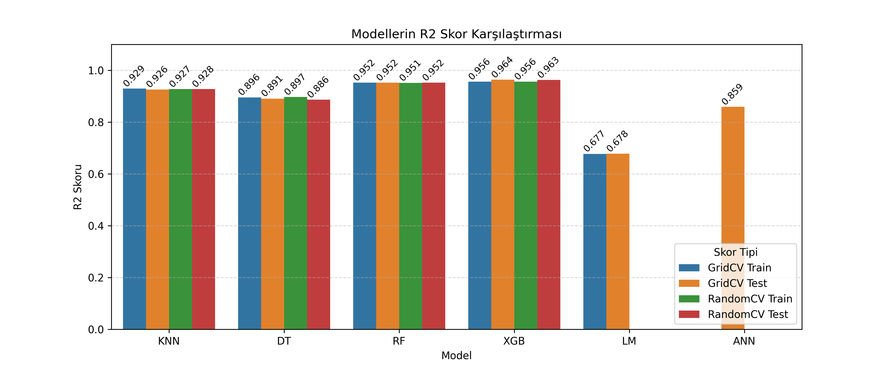
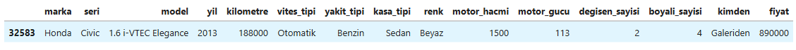
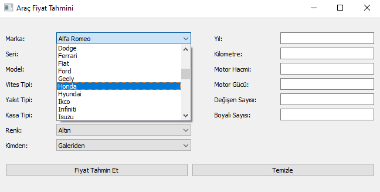
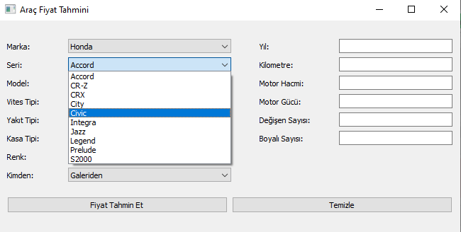
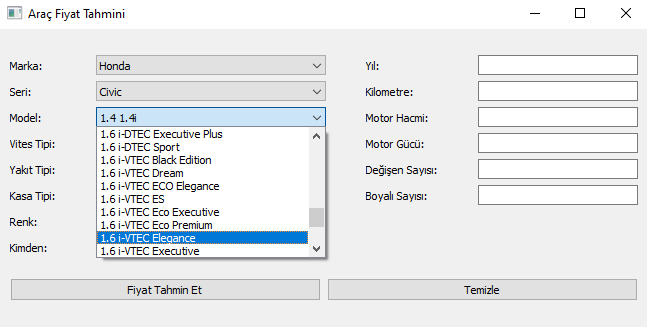
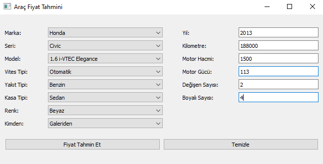
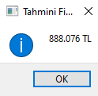

 

<h1 align="center">OTOMOBİL FİYAT TAHMİN UYGULAMASI</h1> 

Bu proje, lisans tezim kapsamında gerçekleştirilmiş olup, `arabam.com` 2. el otomobil ilan sitesinden **asenkron programlama** kullanılarak yaklaşık **50.000 ilan verisi** toplanmıştır. Elde edilen veriler detaylı veri ön işleme adımlarından geçirilmiş ve analiz için uygun hale getirilmiştir. Ardından **keşifsel veri analizi (EDA)** gerçekleştirilmiş ve veriler üzerine çeşitli görselleştirmeler uygulanmıştır. Son olarak, geliştirilmiş model, **6 farklı makine öğrenmesi modeli** ile test edilmiştir. Projenin sonunda ise kullanıcıların fiyat tahmini yapabilmesi için **interaktif bir arayüz** geliştirilmiştir ve örnek bir tahmin uygulanmıştır. 

---

## Hızlı Başlangıç

- [En son sürüm indir](https://github.com/mehmettanriverdii/Otomobil-Fiyat-Tahmin.zip)

- [Lisans tezi pdf](https://github.com/mehmettanriverdii/Otomobil-Fiyat-Tahmin/Makine_Öğrenmesi_Lisans_Tezi.pdf)

- Depoyu klonla: `git clone https://github.com/mehmettanriverdii/Otomobil-Fiyat-Tahmin.git`

## Veri Seti

Satıcılar otomobil fiyatlarını belirlerken motor gücü, motor hacmi, otomobilin yaşı, otomobilin kaç km yaptığı, değişen-boyalı parça sayısı ve diğer parametreler gibi birkaç faktöre bağlı olarak otomobil fiyatlarını belirlediklerini görürüz. Bir satıcı otomobili ilana koyarken ortalama kaç para ettiğini bilmek isteyebilir ya da tam tersi olarak bir müşteri satın alacağı otomobilin ortalama fiyatını öğrenmek isteyebilir. Bu çalışma, geçmiş ikinci el ilan verilerinden yola çıkarak otomobil özellikleri ile fiyat arasında istatistiksel bir ilişki kurmayı ve bu ilişki üzerinden fiyat tahmin modelleri geliştirmeyi hedeflemektedir. Böylece hem alıcılar hem de satıcılar için karar destek sağlayan bir sistem oluşturulması amaçlanmaktadır.

* Veri seti içerisinde bulunan sütunların isimleri ve açıklamaları:
  1. id - Her otomobil için benzersiz numara
  2. marka - Otomobilin markası
  3. seri - Otomobilin serisi veya alt modeli
  4. model - Otomobilin model tipi
  5. yil - Otomobilin üretim yılı
  6. kilometre - Otomobilin o zamana kadar yaptığı toplam yol (km cinsinden)
  7. vites_tipi - Otomobilin vites türü (örneğin: Otomatik, Manuel, Yarı Otomatik)
  8. yakit_tipi - Otomobilin yakıt türü (örneğin: Benzin, Dizel, Hibrit, LPG&Benzin, Elektrik)
  9. kasa_tipi - Otomobilin gövde tipi (örneğin: Sedan, Hatchback)
  10. renk - Otomobilin dış rengi
  11. motor_hacmi - Otomobilin motor hacminin ortalaması (cm3)
  12. motor_gucu - Otomobilin motor gücünün ortalaması (hp)
  13. degisen_sayisi - Otomobilde kaç adet değişen parça olduğunun sayısı
  14. boyali_sayisi - Otomobilde kaç adet boyalı parça olduğunun saysısı 
  15. kimden - İlan sahibinin türü (örneğin: Sahibinden, Galeriden)
  16. fiyat - Otomobilin satış fiyatı (TL cinsinden)

 

- [Veri seti indir](https://github.com/mehmettanriverdii/Otomobil-Fiyat-Tahmin/araba_bilgileri.csv)

## Uygulama

Bu projede 6 farklı makine öğrenmesi modeli uygulanmış, her model için Grid Search ve Random Search yöntemleriyle hiperparametre optimizasyonu gerçekleştirilmiştir. Modellerin performansları, **determinasyon katsayısı (R²)** ve çeşitli hata metrikleri ile karşılaştırılmıştır. Elde edilen sonuçlara göre en başarılı model, uygulamada kullanılmak üzere kaydedilmiştir.

- **Modeller**: KNN, Decision Tree, Random Forest, XGBoost, Lineer Regresyon, ANN

- **Hata Metrikleri**: MAE, MSE, RMSE 

 

 

- **En Başrılı Sonuç**: XGBoost RandomSearchCV

- [Model indir](https://github.com/mehmettanriverdii/Otomobil-Fiyat-Tahmin/xgb_random.pkl)

### Örnek Bir Otomobil Fiyat Tahmini

 

 

