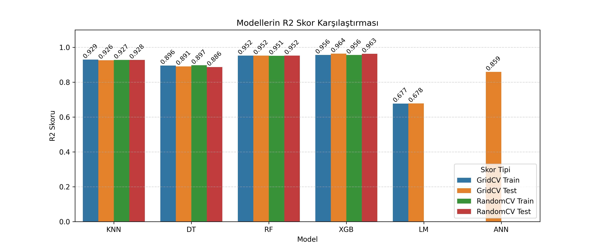
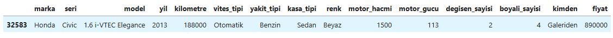
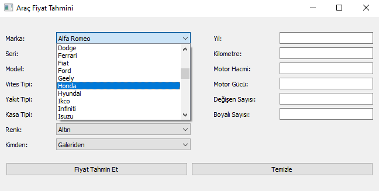
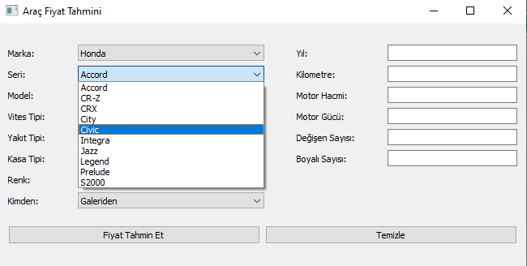
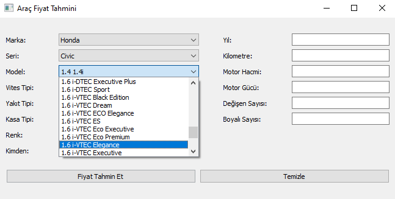
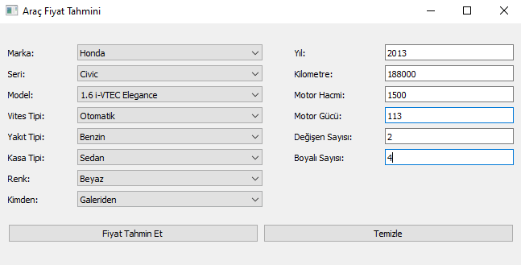
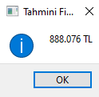

 

<h1 align="center">OTOMOBİL FİYAT TAHMİN UYGULAMASI</h1> 

Bu proje, lisans tezim kapsamında gerçekleştirilmiş olup `arabam.com` ikinci el otomobil ilan sitesinden **asenkron programlama** kullanılarak yaklaşık **50 bin veri** toplanmıştır. Elde edilen veriler detaylı veri ön işleme adımlarından geçirilerek analiz için uygun hale getirilmiştir. Ardından **keşifsel veri analizi (EDA)** gerçekleştirilmiş ve veriler üzerine çeşitli görselleştirmeler uygulanmıştır. Son olarak **6 farklı makine öğrenmesi algoritması** test edilmiştir. Projenin sonunda ise kullanıcıların fiyat tahmini yapabilmesi için **interaktif bir arayüz** geliştirilmiş ve örnek bir tahmin gerçekleştirilmiştir. 

---

## Hızlı Başlangıç

- [⬇️ En son sürüm indir](https://github.com/mehmettanriverdii/Otomobil-Fiyat-Tahmin/archive/refs/heads/master.zip)

- [📄 Tezi Görüntüle](Makine_Öğrenmesi_Lisans_Tezi_Mehmet_Tanrıverdi.pdf)

- [⬇️ Lisans Tezi İndir](https://github.com/mehmettanriverdii/Otomobil-Fiyat-Tahmin/raw/master/Makine_Öğrenmesi_Lisans_Tezi_Mehmet_Tanrıverdi.pdf)

- Depoyu klonla: `git clone https://github.com/mehmettanriverdii/Otomobil-Fiyat-Tahmin.git`

## Veri Seti

Satıcılar otomobil fiyatlarını belirlerken motor gücü, motor hacmi, otomobilin yaşı, kilometre bilgisi, değişen-boyalı parça sayısı ve benzeri birkaç faktörü göz önünde bulundurduğu görülmektedir. Bir satıcı, ilana koyacağı otomobilin ortalama ne kadar piyasa değerine sahip olduğunu bilmek isteyebilir; öte yandan bir müşteri satın alacağı otomobilin ortalama fiyatını öğrenmek isteyebilir. Bu çalışma, geçmiş ikinci el ilan verilerinden yola çıkarak otomobil özellikleri ile fiyat arasında istatistiksel bir ilişki kurmayı ve bu ilişki üzerinden fiyat tahmin modelleri geliştirmeyi hedeflemektedir. Böylece hem alıcılar hem de satıcılar için karar destek sağlayan bir sistem oluşturulması amaçlanmaktadır.

* Veri seti içerisinde bulunan sütunların isimleri ve açıklamaları:

1. **id** – Her otomobil için benzersiz numara  
2. **marka** – Otomobilin markası  
3. **seri** – Otomobilin serisi veya alt modeli  
4. **model** – Otomobilin model tipi  
5. **yil** – Otomobilin üretim yılı  
6. **kilometre** – Otomobilin o zamana kadar yaptığı toplam yol (km)  
7. **vites_tipi** – Otomobilin vites türü (Otomatik, Düz, Yarı Otomatik)  
8. **yakit_tipi** – Otomobilin yakıt türü (Benzin, Dizel, Hibrit, LPG&Benzin, Elektrik)  
9. **kasa_tipi** – Otomobilin gövde tipi (Sedan, Hatchback)  
10. **renk** – Otomobilin dış rengi  
11. **motor_hacmi** – Otomobilin motor hacmi (cm³)  
12. **motor_gucu** – Otomobilin motor gücü (hp)  
13. **degisen_sayisi** – Değişen parça sayısı  
14. **boyali_sayisi** – Boyalı parça sayısı  
15. **kimden** – İlan sahibinin türü (Sahibinden, Galeriden)  
16. **fiyat** – Otomobilin satış fiyatı (TL)

 

**Veri seti akademik çalışmalar için toplanmıştır; ticari amaç hedeflenmemiştir.**

- [📥 CSV Dosyasını İndir](https://github.com/mehmettanriverdii/Otomobil-Fiyat-Tahmin/releases/latest/download/araba_bilgileri.csv)

## Uygulama

Bu projede 6 farklı makine öğrenmesi algoritması uygulanmış, her model için Grid Search ve Random Search yöntemleriyle hiperparametre optimizasyonu gerçekleştirilmiştir. Modellerin performansları **determinasyon katsayısı (R²)** ve çeşitli hata metrikleri ile karşılaştırılmıştır. Elde edilen sonuçlara göre en başarılı model, uygulamada kullanılmak üzere kaydedilmiştir.

- **Modeller**: KNN, Decision Tree, Random Forest, XGBoost, Linear Regression, ANN

- **Hata Metrikleri**: MAE, MSE, RMSE 

 

 

- **En Başarılı Sonuç**: XGBoost RandomSearchCV

- [📥 Modeli İndir](https://github.com/mehmettanriverdii/Otomobil-Fiyat-Tahmin/raw/master/xgb_random.pkl)

### Örnek Bir Otomobil Fiyat Tahmini

 

 

